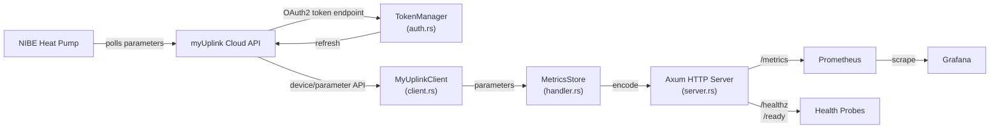

# NIBE Exporter for Prometheus

A high-performance Prometheus exporter for NIBE heat pumps via the myUplink REST API. Written in Rust with careful attention to security, reliability, and operational excellence.


## Features

- **`OAuth2` Authentication**: Secure token management with double-check locking pattern
- **Automatic Token Refresh**: Tokens are refreshed automatically with 30-second safety buffer
- **Rate Limit Handling**: Graceful handling of API rate limits with retry-after support
- **Multi-Version API Support**: Compatible with myUplink API v2 and v3
- **Manual `OpenMetrics` Encoding**: Direct to `OpenMetrics` 1.0.0 format without external dependencies
- **Metrics Caching**: Efficient Arc<String> caching for reader efficiency
- **Healthz & Ready Probes**: Kubernetes-ready health check endpoints
- **JSON Logging**: Structured logging with optional JSON output
- **Distroless Container**: Minimal attack surface with Google distroless images
- **Multi-Architecture Builds**: Docker images for amd64 and arm64
- **Helm Chart**: Production-ready Kubernetes deployment
- **SBOM & Code Signing**: Container images signed with Cosign, SBOM in `CycloneDX` format

## Getting Started

See **[Getting Started Guide](docs/getting-started.md)** for step-by-step setup:
- Register `OAuth2` credentials on myUplink
- Discover your device ID
- Run the exporter with Docker
- Verify metrics are being exposed

For Kubernetes deployment with Helm, see **[Helm Production Deployment](docs/helm-deployment.md)**.

For development setup and building from source, see [Building from Source](#building-from-source) below.

## Endpoints

- `GET /healthz` - Health check (always 200 OK)
- `GET /ready` - Readiness check (200 OK when metrics available)
- `GET /metrics` - Prometheus metrics in `OpenMetrics` format

## Architecture

The exporter polls NIBE heat pump parameters via the myUplink Cloud API, caches them in memory, and exposes them as Prometheus metrics:



**Key components:**
- **TokenManager** (`auth.rs`) - OAuth2 token refresh with double-check locking
- **MyUplinkClient** (`client.rs`) - Handles API calls, rate limit handling, and token refresh
- **MetricsStore** (`handler.rs`) - In-memory metrics cache with Arc<String> for efficient reads
- **Axum Server** (`server.rs`) - HTTP server with health, readiness, and metrics endpoints

## Metrics

All metrics are gauges. All NIBE heat pump parameters are emitted as generic `nibe_parameter_{id}` metrics, where `{id}` is the parameter ID from myUplink (e.g., `40008` for supply temperature). The human-readable parameter name appears in the `parameter_name` label.

### Example Metrics

```
nibe_parameter_40008{device_id="abc123",parameter_id="40008",parameter_name="BT1 Supply temp"} 35.2
nibe_parameter_40083{device_id="abc123",parameter_id="40083",parameter_name="BT3 Return temp"} 28.5
nibe_parameter_40045{device_id="abc123",parameter_id="40045",parameter_name="BT20 External temp"} 5.1
nibe_parameter_40057{device_id="abc123",parameter_id="40057",parameter_name="Compressor frequency"} 45.0
nibe_parameter_43005{device_id="abc123",parameter_id="43005",parameter_name="Total power"} 2500.0
```

### Status Metrics

The exporter tracks internal counters for polling activity (`polls_total`), authentication failures (`auth_failures_total`), rate limiting (`rate_limited_total`), and scrape errors (`scrape_errors_total`). These counters are visible in logs at info level but **are not currently exported as Prometheus metrics**. To monitor exporter health, use the [`/healthz` and `/ready` endpoints](#endpoints) or the `up` metric from Prometheus (via `job_name`).

## API Version

Specify API version via `NIBE_API_VERSION` (default: v2):

- `v2`: Stable, well-documented myUplink API
- `v3`: Latest features and improvements

Invalid versions are rejected at parse time.

## Metrics Mapping

Currently, all parameters from myUplink are emitted as generic `nibe_parameter_{id}` metrics. Custom metric name mappings are a planned feature but not yet implemented. The parameter's human-readable name is available in the `parameter_name` label on each metric.

To rename or relabel metrics for Prometheus, use `relabel_configs` in your Prometheus `ServiceMonitor` or scrape configuration.

## Security

### Encryption

- All network communication uses TLS 1.2+
- Secrets Manager support for credential storage
- Support for mounted secret files (Kubernetes)

### Access Control

- `OAuth2` with client credentials flow
- No hardcoded credentials
- Least-privilege IAM roles in Kubernetes

### Container Security

- Distroless base image (Google's minimal runtime)
- Non-root user execution (UID 65532)
- Read-only root filesystem
- No shell or package manager
- Code signing with Cosign

## Configuration

All configuration is via environment variables. Required and optional variables:

| Variable | Default | Purpose | Example |
|----------|---------|---------|---------|
| `NIBE_CLIENT_ID` | — | myUplink `OAuth2` Client ID | `abc123...` |
| `NIBE_CLIENT_SECRET` | — | myUplink `OAuth2` Client Secret | `xyz789...` |
| `NIBE_API_VERSION` | `v2` | myUplink API version (`v2` or `v3`) | `v2` |
| `NIBE_DEVICE_ID` | — | (Optional) Filter metrics to specific device ID | `device-abc123` |
| `NIBE_POLL_INTERVAL` | `60` | Poll interval in seconds | `60` |
| `NIBE_LISTEN_ADDR` | `0.0.0.0:9090` | HTTP server listen address | `127.0.0.1:9090` |
| `NIBE_LOG_LEVEL` | `info` | Log verbosity (`trace`, `debug`, `info`, `warn`, `error`) | `info` |
| `NIBE_LOG_JSON` | `false` | Enable JSON structured logging | `true` |
| `NIBE_CLIENT_ID_FILE` | — | (Optional) Path to file containing Client ID (for Kubernetes) | `/run/secrets/client-id` |
| `NIBE_CLIENT_SECRET_FILE` | — | (Optional) Path to file containing Client Secret (for Kubernetes) | `/run/secrets/client-secret` |
| `NIBE_METRICS_MAPPING_FILE` | — | (Optional, unused) Path to custom metrics mapping file (planned feature) | — |

For Kubernetes deployment, see **[Helm Production Deployment](docs/helm-deployment.md)** for comprehensive configuration examples including:
- Secret management with Kubernetes Secrets (using `NIBE_CLIENT_ID_FILE` and `NIBE_CLIENT_SECRET_FILE`)
- Prometheus `ServiceMonitor` and `PrometheusRule`
- Network policies (standard Kubernetes and Cilium)
- Grafana dashboard integration

## Building from Source

### Prerequisites

- Rust 1.85.0+ (check with `rustc --version`)
- Linux/macOS/Windows with standard build tools

### Build

```bash
# Development
cargo build

# Release (optimized)
cargo build --release

# Specific features
cargo build --release --all-features
```

### Testing

```bash
# All tests
cargo test --all

# Unit tests only
cargo test --lib

# Integration tests
cargo test --test '*'

# With output
cargo test -- --nocapture

# Specific test
cargo test test_name
```

### Linting

```bash
# Check formatting
cargo fmt --all -- --check

# Format code
cargo fmt --all

# Run clippy
cargo clippy --all -- -D warnings
```

## Docker Build

Build Docker image locally:

```bash
# Using Makefile
make docker-build

# Manual
docker build -t nibe-exporter:dev .

# Multi-architecture
docker buildx build --platform linux/amd64,linux/arm64 -t nibe-exporter .
```

## Development

### Project Structure

```
src/
  lib.rs              # Library root
  main.rs             # Binary entrypoint
  config.rs           # Configuration management
  telemetry.rs        # Observability setup
  server.rs           # HTTP server
  myuplink/           # myUplink API client
    mod.rs
    error.rs          # Error types
    models.rs         # API data models
    auth.rs           # OAuth2 token manager
    client.rs         # HTTP client
  metrics/            # Metrics handling
    mod.rs
    mapping.rs        # Parameter to metric mapping
    encode.rs         # OpenMetrics encoder
    handler.rs        # Metrics store and polling

tests/
  common/             # Shared test utilities
  integration.rs      # Integration tests
  snapshot_metrics.rs # Snapshot tests with insta

charts/
  nibe-exporter/      # Helm chart
```

### Key Design Decisions

1. **Manual `OpenMetrics` Encoding**: No dependency on `prometheus-client`, direct text encoding for control and simplicity
2. **Double-Check Locking**: `TokenManager` uses `RwLock` for efficient token caching with write-once semantics
3. **Arc<String> for Metrics**: Readers clone Arc, not the entire string, for efficiency
4. **`MissedTickBehavior::Delay`**: Polling uses delay behavior to prevent thundering herd
5. **Distroless Container**: Minimal runtime reduces attack surface and image size

### Testing Strategy

- Unit tests for individual components
- Integration tests with wiremock for API mocking
- Snapshot tests with insta for metrics encoding
- No unsafe code (forbidden at linter level)

## Deployment

### Kubernetes (Helm)

See **[Helm Production Deployment](docs/helm-deployment.md)** for complete Helm installation, upgrade, and management procedures.

### Docker Compose

```yaml
services:
  nibe-exporter:
    image: ghcr.io/jalet/nibe-exporter:latest
    environment:
      NIBE_CLIENT_ID: ${NIBE_CLIENT_ID}
      NIBE_CLIENT_SECRET: ${NIBE_CLIENT_SECRET}
      NIBE_API_VERSION: v2
    ports:
      - "9090:9090"
    restart: unless-stopped
```

## Monitoring the Exporter

### Prometheus Configuration

```yaml
scrape_configs:
  - job_name: nibe-exporter
    static_configs:
      - targets: [localhost:9090]
    scrape_interval: 30s
    scrape_timeout: 10s
```

### Alerting Rules

The Helm chart includes `PrometheusRule` with alerts for:

- Exporter down (5+ minutes)
- Authentication failures
- API rate limiting
- Scrape errors

## Troubleshooting

For deployment and configuration troubleshooting, see:
- **[Getting Started Troubleshooting](docs/getting-started.md#troubleshooting)** - setup and credential issues
- **[Helm Deployment Troubleshooting](docs/helm-deployment.md#troubleshooting)** - Kubernetes, `ServiceMonitor`, rate limiting, and secret issues

### General Issues

**Metric cardinality too high**: Filter metrics by device ID if not needed, or review polling interval.

**Rate limiting**: Increase `NIBE_POLL_INTERVAL` or check myUplink API rate limit quotas.

**Container not starting**: Check logs with `docker logs nibe-exporter` or `kubectl logs -l app.kubernetes.io/name=nibe-exporter`.

## Contributing

Contributions are welcome! Please:

1. Fork the repository
2. Create a feature branch
3. Make your changes
4. Add tests for new functionality
5. Ensure all tests pass: `cargo test`
6. Ensure formatting: `cargo fmt --all`
7. Ensure clippy passes: `cargo clippy -- -D warnings`
8. Submit a pull request

## License

MIT License - see LICENSE file

## Support

For issues, questions, or feature requests:
- Open an issue on GitHub
- Check existing issues first
- Include exporter version, Kubernetes version (if applicable)
- Include relevant logs and configuration (without credentials)

## Roadmap

- [ ] Configuration file support (TOML/YAML)
- [ ] Custom metrics mapping
- [ ] Multi-device dashboard templates
- [ ] Historical data retention
- [ ] Webhook notifications
- [ ] Performance optimizations
